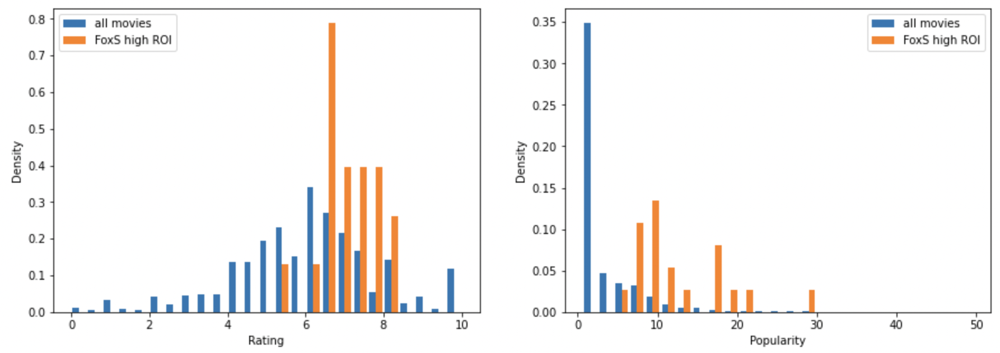

# Introduction

**Author**: Amelia Dobronyi

## Overview

This presentation presents recommendations for Microsoft to follow in starting a new movie studio to create original content.

## Business Objective

Microsoft needs concrete recommendations to determine how they should proceed to make films.

To evaluate the success of its films, and the business unit as a whole, Microsoft should look at return on investment, or ROI.

## Data

The data used was: production budget and box office results, box office results by studio, movie ratings and popularity metrics, and key persons and genre information.

## Recommendation 1

Microsoft should look to emulate the efforts of studios that have consistently high ROIs, such as FoxS.

## Recommendation 2

Concentrate on ratings and popularity as drivers of studio ROI, as FoxS was able to do.

## Recommendation 3

Focus on making primarily dramas, as those account for nearly all of the high ROI films that FoxS produced.

## Future Improvements to Analysis

Break down box office results into smaller segments, such as domestic vs. worldwide segments.

Look at interactive effects, e.g. key persons within genres.

## Conclusion 

Microsoft should look to emulate the production patterns of successful studios, such as FoxS, as determined by ROI.

Though the studio may seek to vary the kinds of films it produces, at least half should be considered ‘dramas’.

Cumulative ROI of the studio should be monitored to evaluate going concern.

