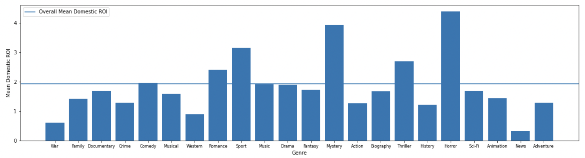

# Introduction

**Author**: Amelia Dobronyi  
**Pace**: Flex  
**Instructor**: Abhineet Kulkarni  

## Overview

This presentation presents recommendations for Microsoft to follow in starting a new movie studio to create original content.

## Business Objective

Microsoft needs concrete recommendations to determine how they should proceed to make films.

To evaluate the success of its films, and the business unit as a whole, Microsoft should look at return on investment, or ROI.

## Data

The data used was: production budget and box office results, box office results by studio, movie ratings and popularity metrics, and key persons and genre information.

## Recommendation 1

Microsoft should look to emulate the efforts of studios that have consistently high ROIs, such as FoxS.

## Recommendation 2

Microsoft should make films in the following genres: horror, mystery, thriller, sport, and romance.

## Recommendation 3

The films Microsoft produces should be between 75 to 90 minutes long, and should be released around April or July.

## Future Improvements to Analysis

Break down box office results into smaller segments, such as domestic vs. worldwide segments.

Look more closely at key people to inform hiring decisions.

## Conclusion 

Microsoft should look to emulate the production patterns of successful studios, such as FoxS, as determined by ROI.

The studio should look to produce films in the following genres: horror, mystery, thriller, sport, and romance.

Targeted films should be just under 90 minutes, and released in either late spring or mid-summer.

## Repository structure

- technical notebooks: phase_1_project_v1, phase_1_project_v2 (final)
- figures folder
- data sets: bom.movie_gross.csv, im.db, rt.movies_info.tsv, rt.reviews.tsv, tmbd.movies.csv, tn.movie_budgets.csv
- README.md
- presentation.pdf
